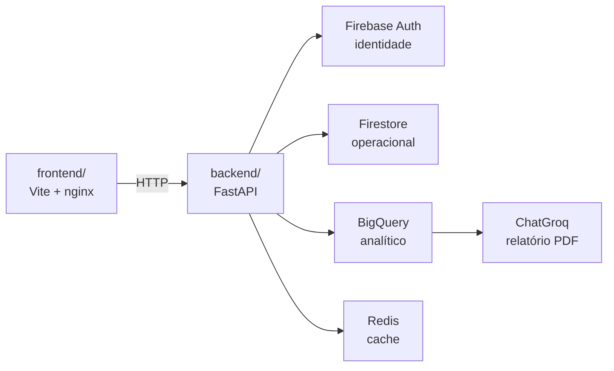

# Arquitetura

## Dois serviços, um repositório

O repositório é um monorepo com duas aplicações independentes, cada uma com o seu
`Dockerfile`. No Railway, cada uma vira um serviço separado, apontando o *root
directory* para a sua pasta.



O frontend fala com o backend por HTTP, usando a URL pública do serviço. Nada de
sessão compartilhada nem estado no servidor: o token do Firebase viaja em cada
requisição.

## Camadas do backend

A direção das dependências é **regra dura**, não sugestão:

```
api/ ──▶ agents/ · ingestion/ · storage/ ──▶ domain/
(entrega)      (orquestração/IO)          (regras puras)
```

| Pasta | Responsabilidade |
| --- | --- |
| `domain/` | Regras de negócio puras. **Não importa framework nenhum.** |
| `api/` | Endpoints, schemas de entrada/saída e dependências do FastAPI. Só orquestra. |
| `agents/` | Tudo de IA: prompt, chamada ao LLM, montagem do relatório. |
| `ingestion/` | Entrada de dados: validação do CSV e preparo dos registros. |
| `storage/` | Clientes de persistência e credenciais. |
| `config/` | `settings.py` é o **único** lugar que lê variável de ambiente. |
| `jobs/` | Tarefas de fundo e agendadas. |

!!! warning "Por que a regra importa"
    Este projeto já trocou de camada de entrega uma vez, saindo do Reflex. O que
    sobreviveu intacto foi exatamente o que não importava o framework. Manter
    `domain/` puro é o que faz a próxima troca ser uma troca, e não uma reescrita.

## Onde cada dado vive

**Firestore** guarda o operacional: o vínculo entre o usuário do Firebase e o
CPF/CNPJ do investidor, e os aportes que o dashboard lê.

**BigQuery** (`dados_fidc.tb_aporte`) guarda o analítico. É de lá que o relatório
por IA puxa a carteira do investidor.

**Redis** guarda o que é caro de recalcular e barato de ficar desatualizado por
alguns minutos.

!!! danger "O schema mora em dois lugares"
    Mudar as colunas do aporte exige alterar **junto** o schema do job
    (`ingestion/aportes.py::_SCHEMA_BIGQUERY`) e o contrato do CSV
    (`ingestion/csv_processor.py::COLUNAS_OBRIGATORIAS`). Não há migração
    automática entre eles: esquecer um lado gera divergência silenciosa.
