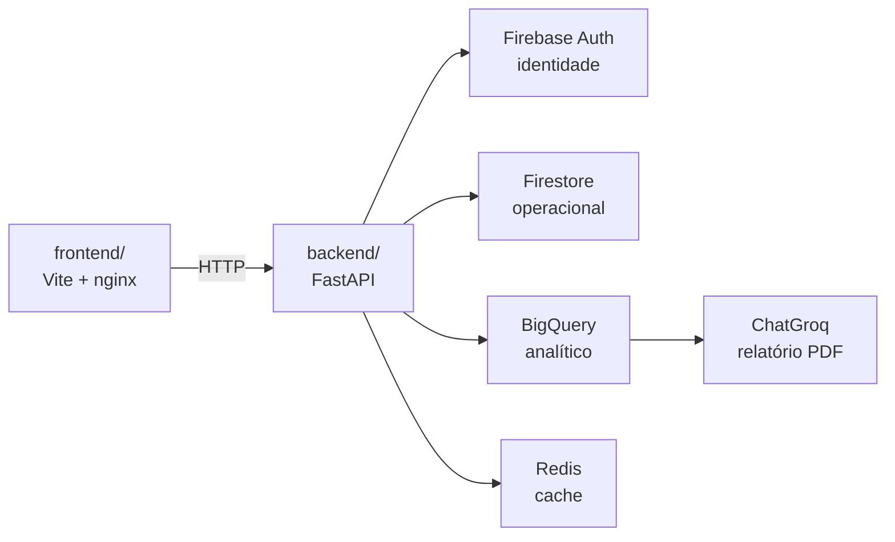

# Arquitetura

## Dois serviços, um repositório

O repositório é um monorepo com duas aplicações independentes, cada uma com o seu
`Dockerfile`. No Railway, cada uma vira um serviço separado, apontando o *root
directory* para a sua pasta.


```mermaid
flowchart LR
    F["frontend/<br>Vite + nginx"] -->|HTTP| B["backend/<br>FastAPI"]
    B --> AUTH["Firebase Auth<br>identidade"]
    B --> FS["Firestore<br>operacional"]
    B --> BQ["BigQuery<br>analítico"]
    B --> R["Redis<br>cache"]
    BQ --> LLM["ChatGroq<br>relatório PDF"]
```

O frontend fala com o backend por HTTP, usando a URL pública do serviço. Nada de
sessão compartilhada nem estado no servidor: o token do Firebase viaja em cada
requisição.

## Camadas do backend

A direção das dependências é **regra dura**, não sugestão:

```
api/ ──▶ agents/ · storage/ ──▶ domain/
(entrega)  (orquestração/IO)  (regras puras)
```

| Pasta | Responsabilidade |
| --- | --- |
| `domain/` | Regras de negócio puras. **Não importa framework nenhum.** |
| `api/` | Endpoints, schemas de entrada/saída e dependências do FastAPI. Só orquestra. |
| `agents/` | Tudo de IA: prompt, chamada ao LLM, montagem do relatório. |
| `storage/` | Clientes de persistência e credenciais. |
| `config/` | `settings.py` é o **único** lugar que lê variável de ambiente. |
| `jobs/` | Tarefas de fundo e agendadas. |

!!! warning "Por que a regra importa"
    Este projeto já trocou de camada de entrega uma vez, saindo do Reflex. O que
    sobreviveu intacto foi exatamente o que não importava o framework. Manter
    `domain/` puro é o que faz a próxima troca ser uma troca, e não uma reescrita.

## Onde cada dado vive

**Firestore** guardaria o operacional: o vínculo entre o usuário do Firebase e o
CPF/CNPJ do investidor. Nada implementado ainda.

**BigQuery** é usado como **ferramenta de consulta** (dataset em
`BIGQUERY_DATASET`) — não como destino de escrita do sistema. É de lá que o
relatório por IA tenta puxar a carteira do investidor, na tabela `tb_aporte`.

**Redis** guardaria o que é caro de recalcular e barato de ficar desatualizado
por alguns minutos. Nada implementado ainda.

!!! danger "Nada escreve em tb_aporte"
    O fluxo de upload de CSV que gravava aportes foi removido de propósito — não
    é assim que a plataforma vai operar. O que o substitui (consultar algum
    serviço externo que já tenha esses dados) ainda não foi desenhado. Até essa
    decisão existir, `agents/relatorio.py` sempre falha ao buscar a carteira do
    investidor: a tabela está vazia e ninguém a alimenta.
