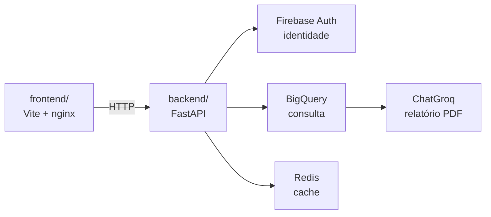

# Arquitetura

Como a plataforma é construída. Para o que ela faz, sem tecnologia, ver
[Produto](../produto/index.md). Para o que falta implementar, ver [Roadmap](../roadmap/index.md).

## Visão geral

Dois serviços independentes no mesmo repositório (monorepo), cada um com o
seu `Dockerfile`. No Railway, cada um vira um serviço separado, apontando o
*root directory* para a sua pasta — `backend/` ou `frontend/`.



O frontend fala com o backend por HTTP, usando a URL pública do serviço. Nada
de sessão compartilhada nem estado no servidor: o token do Firebase viaja em
cada requisição.

## Stack escolhida, e por quê

| Camada | Escolha | Por quê |
| --- | --- | --- |
| Backend | FastAPI | O projeto nasceu como monolito **Reflex**, que acopla UI e servidor no mesmo processo e no mesmo modelo de estado — impossível escalar as duas partes de forma independente, trocar uma sem mexer na outra, ou ter um app móvel depois. Reflex foi removido por completo; todas as telas foram descartadas e serão reescritas. |
| Frontend | Vite | Separado do backend de propósito, consumindo a API por HTTP — a mesma razão que tirou o Reflex. Não React/Next: o escopo do frontend é uma SPA simples servida como estático, sem exigir um framework de aplicação completo. |
| Autenticação | Firebase Auth | A implementação anterior guardava hash bcrypt numa tabela própria, sem token, sem refresh, sem recuperação de senha e sem login social — cada um desses itens é trabalho e risco que não agregam nada ao produto. O backend não guarda senha nenhuma: só verifica a assinatura do token e lê as claims. |
| Dados analíticos | BigQuery | Usado como **ferramenta de consulta**, não como destino de escrita do sistema. É de lá que o relatório por IA busca a carteira do investidor. |
| Dados operacionais | Nenhum banco próprio ainda | Postgres saiu do projeto e **não foi substituído por um banco operacional novo**. Firestore foi cogitado, mas rejeitado para os dados de aporte: ele não agrupa no servidor (sem `GROUP BY`), e a consulta central do produto é exatamente agregação — soma de volume, média de score por bloco. Reimplementar isso em Python é reimplementar o que SQL já faz bem. Se Firestore entrar, fica restrito ao vínculo Firebase UID ↔ CPF/CNPJ do investidor — e talvez nem precise de banco separado, se esse vínculo virar *custom claim* no próprio token do Firebase. |
| Cache | Redis | Ainda não implementado. Reservado para o que for caro de recalcular e barato de ficar desatualizado por alguns minutos — a leitura agregada do dashboard, quando existir. |
| IA | Groq + Langchain | Gera o relatório em PDF a partir dos dados reais da carteira do investidor. |

## Infraestrutura

**Railway**, com dois serviços — um para `backend/`, um para `frontend/` — porque já existe plano contratado, e cada serviço aponta direto para a pasta correspondente do monorepo, sem infraestrutura extra a configurar.

**Google Cloud** hospeda os dados: BigQuery para consulta, e (quando implementado) Firestore para o vínculo de identidade.

## Camadas do backend

A direção das dependências é **regra dura**, não sugestão:

```
api/ ──▶ agents/ · storage/ ──▶ domain/
(entrega)  (orquestração/IO)  (regras puras)
```

| Pasta | Responsabilidade |
| --- | --- |
| `domain/` | Regras de negócio puras e contratos Pydantic. **Não importa framework nenhum.** |
| `api/` | Endpoints, schemas de entrada/saída e dependências do FastAPI. Só orquestra. |
| `agents/` | Tudo de IA: prompt, chamada ao LLM, montagem do relatório. |
| `storage/` | Clientes de persistência e credenciais. |
| `config/` | `settings.py` é o **único** lugar que lê variável de ambiente. |
| `jobs/` | Tarefas de fundo e agendadas. |

!!! warning "Por que a regra importa"
    Este projeto já trocou de camada de entrega uma vez, saindo do Reflex. O que
    sobreviveu intacto foi exatamente o que não importava o framework. Manter
    `domain/` puro é o que faz a próxima troca ser uma troca, e não uma reescrita.

!!! danger "Nada escreve em tb_aporte hoje"
    O fluxo que gravava aportes (upload manual pela gestora) foi removido de
    propósito — não é assim que a plataforma vai operar. O que o substitui
    ainda não foi desenhado (ver [Roadmap](../roadmap/index.md)). Até essa decisão
    existir, o relatório por IA sempre falha ao buscar a carteira do
    investidor: a tabela está vazia e ninguém a alimenta.
